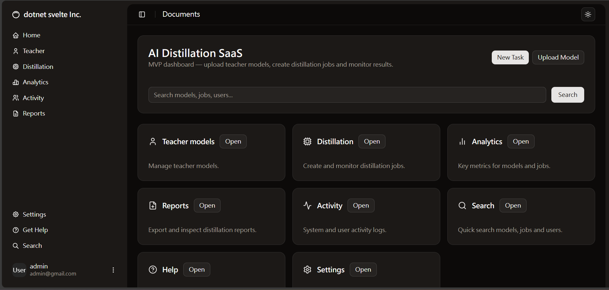
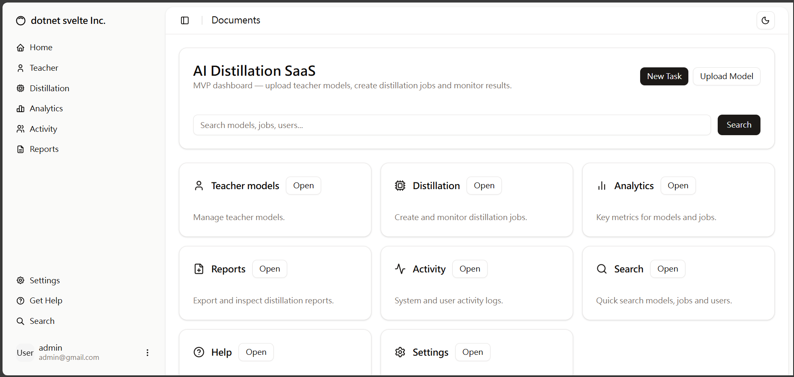
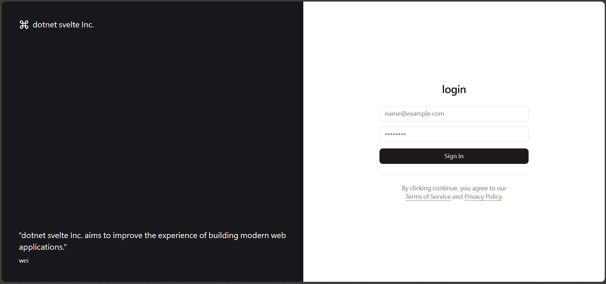

# dotnet-svelte-admin





A starter admin panel project combining a .NET backend and a Svelte frontend.

This repository contains two main folders:

- `backend/` - ASP.NET Core Web API project
- `frontend/` - Svelte + Vite frontend

## Features

- JWT authentication (Bearer tokens) — backend issues JWTs for authenticating API requests. Configure the secret via environment variables or `backend/appsettings.Development.json` and keep it out of source control.

- Svelte + Vite frontend with Tailwind CSS and shadcn-style UI components (in-repo UI primitives). Supports light and dark themes (black/white) with a UI toggle.

- PostgreSQL persistence with EF Core on the backend.

## Quick overview

- Backend: .NET (see `backend/backend.csproj`). The backend exposes API endpoints and uses the configuration files under `backend/`.
- Frontend: Svelte + Vite. The frontend is located in `frontend/` and uses `pnpm` as the package manager.

Both frameworks are designed for high performance: .NET delivers a fast, scalable server platform with mature JIT/AOT optimizations and robust I/O/concurrency support, while Svelte compiles away the framework at build time to produce minimal runtime code and highly efficient client updates.

## Prerequisites

- .NET SDK (recommended: .NET 9 matching the project files)
- Node.js (LTS)
- pnpm (you can install it globally via npm)
- PostgreSQL (local install or Docker)

Install pnpm globally (if you don't have it):

```powershell
npm i -g pnpm
```

## Docker on Windows (Docker Desktop recommended)

If you plan to run PostgreSQL with Docker on Windows, installing Docker Desktop is the recommended and simplest option. Docker Desktop provides the Docker Engine, CLI, and a GUI, and integrates with WSL2 for best performance.

Quick checks (PowerShell):

```powershell
# verify Docker is available
docker --version
# verify WSL status (if using WSL2 backend)
wsl --status
```

If `docker --version` reports an error, install Docker Desktop:

1. Download Docker Desktop for Windows from the official site and run the installer.
2. During installation, enable the WSL2 backend if prompted (recommended).
3. Restart your machine if the installer asks.
4. Start Docker Desktop and ensure it shows "Docker is running".

Notes:
- Modern Windows 10/11 installations typically require WSL2 for the Docker Desktop backend. Follow Docker's installer prompts to enable WSL2 if needed.
- On corporate machines with strict policies, Docker Desktop may be blocked; see Alternatives below.

Alternatives (if you can't or don't want to install Docker Desktop):

- Install PostgreSQL natively on Windows using the official installer or Chocolatey.
- Use a remote/cloud PostgreSQL instance (Heroku Postgres, ElephantSQL, AWS RDS, etc.).
- Use Podman if you prefer a Docker-compatible alternative and it's available on your system.
- Run Docker on a separate VM or another host and connect to it from your machine.

## Database (PostgreSQL) setup

The backend expects a PostgreSQL database. You can either install PostgreSQL locally or run it in Docker.

Quick start with Docker (PowerShell):

```powershell
# pull and run a PostgreSQL container
docker run --name dotnet-svelte-admin-db -e POSTGRES_USER=admin -e POSTGRES_PASSWORD=secret -e POSTGRES_DB=dotnet_svelte_admin -p 5432:5432 -d postgres:15
```

Create database and user using `psql` (if needed):

```powershell
# connect as the default 'postgres' user (you may be prompted for the password set in the container)
psql -h localhost -U postgres -c "CREATE DATABASE dotnet_svelte_admin;"
psql -h localhost -U postgres -c "CREATE USER admin WITH PASSWORD 'secret';"
psql -h localhost -U postgres -c "GRANT ALL PRIVILEGES ON DATABASE dotnet_svelte_admin TO admin;"
```

Example connection string to put in `backend/appsettings.Development.json` or environment variables:

```json
"ConnectionStrings": {
  "DefaultConnection": "Host=localhost;Port=5432;Database=dotnet_svelte_admin;Username=admin;Password=secret"
}
```

Apply EF Core migrations (if the project uses migrations):

```powershell
# from the backend folder
cd backend
# if dotnet-ef is not installed globally
dotnet tool install --global dotnet-ef
# run migrations
dotnet ef database update
```

If no migrations are present, either add them or ensure the backend can create the schema at startup (check project docs or `Program.cs`).

## Setup

Follow these steps to run both backend and frontend locally.

### Backend (development)

1. Open the `backend/` folder in your IDE (Visual Studio, VS Code, or Rider).
2. Restore and run the project. From the `backend/` folder you can use the .NET CLI:

```powershell
# from repository root
cd backend
dotnet restore
dotnet build
dotnet run
```

3. In Visual Studio you can also press F5 to start the project with debugging (the solution file is `dotnet-svelte-admin.sln`).

Configuration files of interest:

- `backend/appsettings.json` and `backend/appsettings.Development.json`

### Frontend (development)

From the repository root or directly inside the `frontend/` folder:

```powershell
cd frontend
pnpm install
pnpm run dev
```

Open the dev server URL printed by Vite (usually `http://localhost:5173`) in your browser.

Note: older notes in this repo refer to `fronted` — the correct folder name is `frontend`.

#### Environment file (.env)

Create a `.env` file in the `frontend/` folder so the client can read the API base URL. Vite/Svelte exposes variables prefixed with `PUBLIC_` to the browser.

PowerShell example (from repository root):

```powershell
# create the file and write the variable
cd frontend
'PUBLIC_apiUrl=http://localhost:5000' | Out-File -Encoding utf8 .env

# verify the file
Get-Content .\frontend\.env
```

In the frontend code use the exposed variable via `import.meta.env.PUBLIC_apiUrl` (or the framework's env helper) to build API requests.

## Build for production

Backend:

```powershell
cd backend
dotnet publish -c Release -o ./publish
```

Frontend:

```powershell
cd frontend
pnpm install
pnpm run build
# the build output will be in frontend/dist (or as configured in Vite)
```

You can host the frontend static output with any static host or serve it from the backend project if configured.

## Environment & Secrets

- Keep sensitive values (connection strings, JWT secrets) out of source control. Use environment variables or a secrets manager.
- Check `backend/appsettings.Development.json` for development-only defaults.

- You can generate a 32-character secret using OpenSSL. Examples (git bash):

```powershell
# 32 hexadecimal characters (16 bytes -> 32 hex chars)
openssl rand -hex 16

# 32 Base64 characters (24 bytes -> 32 base64 chars, no padding)
openssl rand -base64 24
```

- Add local config/secrets files to `.gitignore` so they are not committed. Example `.gitignore` entries:

```gitignore
# local development secrets
backend/appsettings.Development.json
.env
.env.local
```

- If you accidentally committed secrets, stop tracking the file and commit the change (this removes the file from the index but keeps it locally):

```powershell
# stop tracking the file and commit the removal
git rm --cached backend/appsettings.Development.json
git commit -m "Remove local config from repository"
git push
```

- Warning: `git rm --cached` removes the file from the current and future commits but does not erase it from the repository history. To fully remove sensitive data from the history, use a history-rewriting tool such as BFG Repo-Cleaner or `git filter-repo`, and then force-push. Be careful: rewriting history affects collaborators.

## Troubleshooting

- If `pnpm run dev` fails, ensure Node.js and `pnpm` are installed and that you ran `pnpm install`.
- If the backend fails to start, run `dotnet build` to see compile errors, and verify the correct .NET SDK is installed (run `dotnet --info`).
- If the backend cannot connect to PostgreSQL, confirm the connection string in `appsettings` or environment variables and that PostgreSQL is running and accepting connections on port 5432.

## Contributing

Contributions are welcome. Suggested workflow:

1. Fork the repo.
2. Create a feature branch.
3. Open a pull request with a clear description and tests if applicable.

## License

See the `LICENSE` file in the repository root.

## Contact / Notes

If you want, tell me which parts you'd like expanded (API docs, env variables, deployment steps, CI/CD), and I can add them to this README.
